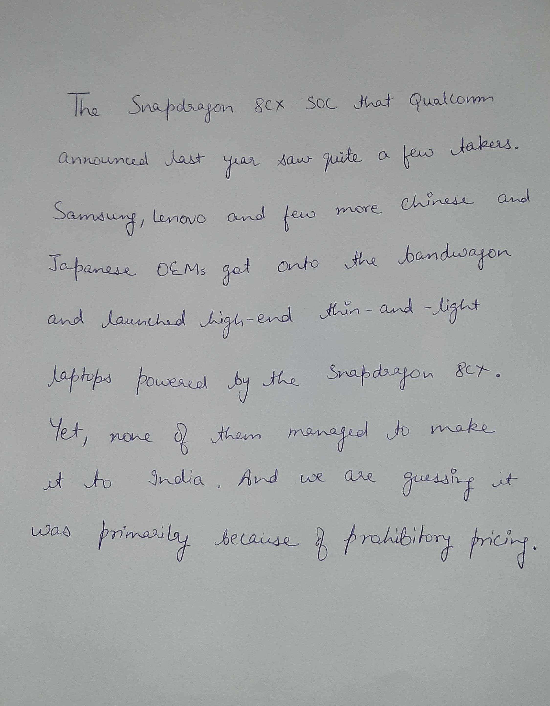
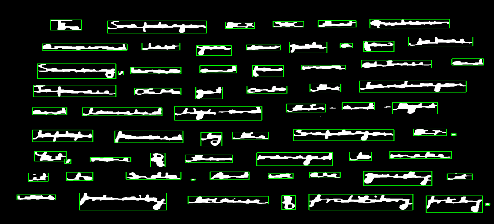

# Word Segmentation

The algorithm takes an image of line as input and outputs the segmented words. The algorithm achieve good results, is fast, and  is easy to implement.

### Run demo
Run the script `checkout.py`. The test image from the current directory will be taken i.e. `test.jpg` are segmented into words and the results are saved to the `segmented/` directory.

Tested on python 3.6 & 3.7

The illustration below shows how the algorithm works:  
 

